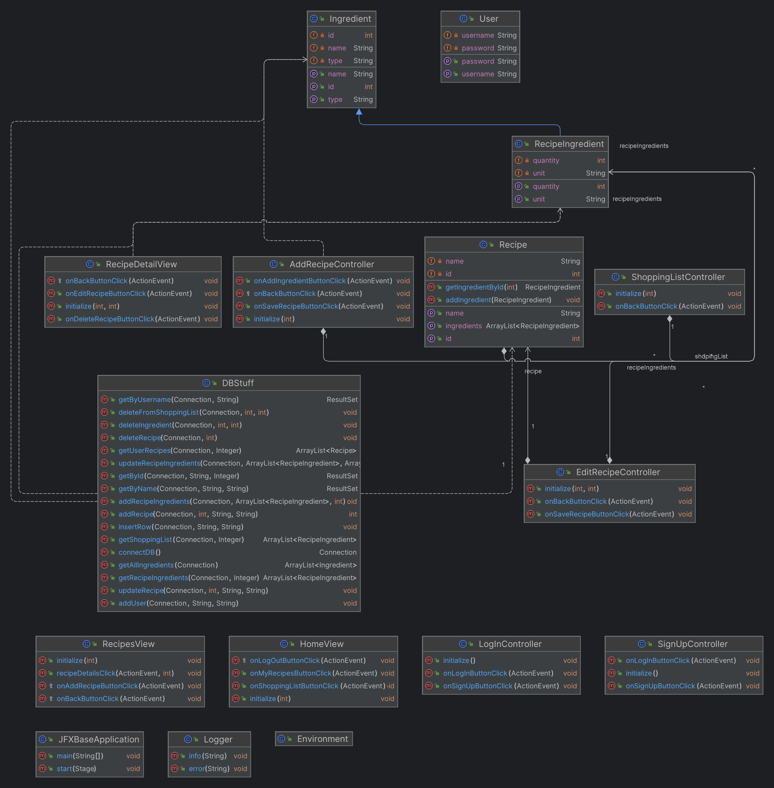
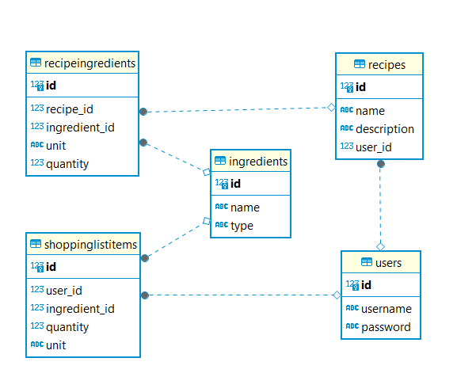

# Recipe Management App  

---

## Description
This is a JavaFX app that allows users to create and manage
their own recipes. I build this app as a university project
for the Object Oriented Programming and Databases courses.  
The app has the following features:
- Users can create an account (requires only username and password)
- They can log in and create their own recipes selecting from the available 
ingredients, specifying amounts, writing descriptions of the recipes
- They can also edit and delete recipes at any time
- Users can add any ingredient to a Shopping List while viewing
a recipe, and remove them once they buy them

---
## Installation

To install this project make sure you have git and IntelliJ IDEA 
installed. Make sure you have the Git plugin installed in IntelliJ

Steps:
1. Open IntelliJ IDEA, go to "File" > "New" > "Project from Version Control" > 
"Git"
2. In the "Git Repository URL" field, paste the repository URL of this project
3. Click on the "Clone" button and import as Maven project
4. IntelliJ will recognize the Maven project and get the dependencies specified 
in the pom.xml file
5. Locate the JFXBaseApplication and run!

---
## Usage  

- Once the application has started you can create an account by pressing the
"Sign up" button
- Go back to the Log In screen and log in
- Go to "My Recipes" to add or view your recipes
- Click on a recipe > "Edit Recipe" to edit it
- Other features usable like in other apps

---
## Class Diagram

----
## Database Design

